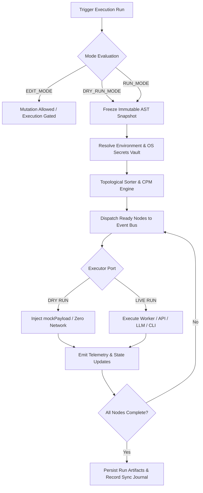

# INOU System Architectural & Technical Specification (`main-specs-goals.md`)

| Property | Value |
| :--- | :--- |
| **Document Version** | `1.0.0-PROD` |
| **System Classification** | Deterministic Integration-First Orchestrator & Task DAG Engine |
| **Execution Runtime** | Node.js / TypeScript / SQLite / Distributed Event Bus |
| **Architecture Style** | Hexagonal (Ports & Adapters) / Clean Architecture / SOLID |
| **Primary Spec Status** | Canonical Master Specification (`main-specs-goals.md`) |

---

## 1. Mission & Core Architectural Philosophy

INOU is a deterministic workflow orchestrator, structured planning engine, and multi-device execution runtime. Its fundamental design principle is to act strictly as a coordination and orchestration fabric. INOU does not implement proprietary domain-specific business logic (e.g., audio demuxing, video rendering, tax accounting, or machine learning model training). Instead, it delegates all computational, analytical, document compilation, and reasoning tasks to external tools, CLI binaries, specialized LLM providers, container runtimes, and standard protocols (MCP, REST, SOAP, Webhooks).

### 1.1 Structural Hierarchy: Projects $\rightarrow$ Workflows $\rightarrow$ Nodes

INOU organizes all operational models into a strict, three-tier containment hierarchy:

$$\mathbf{Projects} \quad \Longrightarrow \quad \mathbf{Workflows} \quad \Longrightarrow \quad \mathbf{Connected\ Nodes\ /\ Tasks\ /\ Steps\ (DAG\ AST)}$$

1. **Projects (`Project`)**: The top-level administrative and organizational boundary. A Project defines global execution environments (Staging, Production), master jurisdiction defaults (country, state, municipality), credentials/secrets vault references, and aggregates one or more business workflows.
2. **Workflows (`Workflow`)**: Discrete, executable processes within a project. A Workflow defines its root entry points, execution barrier policies, active schedules, and encapsulates a directed acyclic graph (DAG) of interdependent tasks.
3. **Nodes (`INOUCompositeNode`)**: The recursive building blocks of execution. Every Epic, Task, Sub-task, and Step is a node in the workflow AST. Nodes declare input/output artifact contracts, dependency edges (FS, SS, FF, SF), execution timeouts, and concrete tool executors.

### 1.2 Architectural Axioms

* **Recursive Composite AST**: Epics, Tasks, Sub-tasks, and Steps share a single unified node schema (`INOUCompositeNode`). Any node can host sub-nodes, define dependency edges, declare artifact contracts, and attach runtime resilience policies.
* **Deterministic Operational Modes**: Strict tri-mode operational isolation (`EDIT_MODE`, `DRY_RUN_MODE`, `RUN_MODE`). The AST is fully mutable during editing, but transitions to an immutable snapshot upon running, completely preventing concurrent mutation race conditions.
* **Parity in Execution & Telemetry**: `DRY_RUN_MODE` and `RUN_MODE` execute against the identical Event Bus, dispatch identical telemetry events, and power identical UI status visualizations.
* **Integration-First Delegation**: Native LLMs handle structured text formats (Markdown, JSON, XML, YAML, HTML). Compiled and binary formats (DOCX, PDF, XLSX) are produced via chained CLI tools (`pandoc`, `typst`, `weasyprint`, headless Chrome, `exceljs`). Project tracking delegates directly to Jira, Trello, or MCP tools.
* **Progressive & Non-Nagging Elicitation**: AST generation is gated behind a Context Sufficiency check. Clarifications are issued strictly one at a time using permanent, immutable identifiers (`[Q-001]`).
* **Hierarchical Cultural & Jurisdictional Awareness**: Legal, tax, labor, and sanitary regulations are optionally injected into prompt contexts via cascading jurisdiction profiles (Project $\rightarrow$ Workflow $\rightarrow$ Epic $\rightarrow$ Task), with active support for cross-border dependency boundaries.
* **Local-First with Cloud & Multi-Device Synchronization**: All entities (Projects, Workflows, Nodes, Edges, Clarifications) persist in local SQLite databases with dedicated sync metadata and an append-only sync journal, enabling seamless multi-device retrieval and cloud replication (Red Colmena).

---

## 2. Clean Architecture, SOLID & Dependency Injection Blueprint

The platform is structured into four concentric layers. Dependencies point strictly inward.

```text
                      +-------------------------------------------------+
                      |           Frameworks & Drivers Layer            |
                      |  (Fastify/Express, SQLite, React UI Canvas,     |
                      |   CLI Shell, MCP STDIO/SSE, OS Keyring)         |
                      +------------------------+------------------------+
                                               |
                      +------------------------v------------------------+
                      |        Interface Adapters & Ports Layer         |
                      |  (REST Connectors, Jira/Trello Importers,       |
                      |   SOAP Clients, Pandoc/CLI Exec, MCP Adapter)   |
                      +------------------------+------------------------+
                                               |
                      +------------------------v------------------------+
                      |            Use Cases / Engine Layer             |
                      |  (RunOrchestrator, DryRunValidator,             |
                      |   GraphifyIndexer, PlanDecomposer, CPM Engine)  |
                      +------------------------+------------------------+
                                               |
                      +------------------------v------------------------+
                      |                  Domain Layer                   |
                      |  (Project, Workflow, INOUCompositeNode, AST,    |
                      |   DependencyGraph, ArtifactContract, BaseEntity)|
                      +-------------------------------------------------+
```

### 2.1 Domain Interfaces & Ports (`CoreContracts.ts`)

```typescript
// CoreContracts.ts
import { INOUCompositeNode, NodeState, ArtifactContract, Project, Workflow } from './NodeSchema';

export abstract class BaseEntity {
  id: string;
  createdAt: Date;
  updatedAt: Date;
  cloudSyncId?: string;
  syncVersion: number;
  syncStatus: 'LOCAL_ONLY' | 'SYNCED' | 'MODIFIED' | 'CONFLICT';
  syncHash?: string;
  deviceOriginId?: string;
  lastSyncedAt?: Date;

  constructor(id: string, createdAt?: Date, updatedAt?: Date) {
    this.id = id;
    this.createdAt = createdAt || new Date();
    this.updatedAt = updatedAt || new Date();
    this.syncVersion = 1;
    this.syncStatus = 'LOCAL_ONLY';
  }
}

export interface IRepository<T extends BaseEntity> {
  findById(id: string): Promise<T | null>;
  findAll(filter?: Partial<T>): Promise<T[]>;
  save(entity: T): Promise<T>;
  saveBatch(entities: T[]): Promise<void>;
  delete(id: string): Promise<boolean>;
  exists(id: string): Promise<boolean>;
}

export interface IProjectRepository extends IRepository<Project> {
  findByName(name: string): Promise<Project | null>;
}

export interface IWorkflowRepository extends IRepository<Workflow> {
  findByProjectId(projectId: string): Promise<Workflow[]>;
}

export interface INodeRepository extends IRepository<INOUCompositeNode> {
  findByWorkflowId(workflowId: string): Promise<INOUCompositeNode[]>;
  findByProjectId(projectId: string): Promise<INOUCompositeNode[]>;
  findBySemanticPath(workflowId: string, path: string): Promise<INOUCompositeNode | null>;
  updateState(uuid: string, state: NodeState): Promise<void>;
}

export interface ExecutionContext {
  runId: string;
  projectId: string;
  workflowId: string;
  environment: string;
  variables: Record<string, string>;
  secrets: Record<string, string>;
  isDryRun: boolean;
  activeJurisdiction?: string;
}

export interface ExecutionResult {
  state: NodeState;
  outputs: Record<string, unknown>;
  logs: string[];
  executionTimeMs: number;
  error?: {
    code: string;
    message: string;
    stack?: string;
  };
}

export interface IExecutorPort {
  execute(node: INOUCompositeNode, context: ExecutionContext): Promise<ExecutionResult>;
}

export interface ITelemetryPort {
  emit(event: string, payload: Record<string, unknown>): void;
}

export interface ISecretVaultPort {
  getSecret(key: string): Promise<string | null>;
  setSecret(key: string, value: string): Promise<void>;
}
```

### 2.2 Dynamic Trust Governance, Identity & Immutable Audit Architecture

Following the iNoU Zero-Trust and Dynamic Governance model:

* **Dynamic Trust Scores (`TrustScore` 0–100)**: Evaluates all connected entities (users, MCP servers, peer nodes). High-risk operations require verification gates (`HighTrust` $\ge 80$).
* **Sub-2ms Reactive Circuit Breaker**: Immediate disconnect and penalization (-100 pts) upon detecting prompt injection attempts or authorization tampering.
* **Immutable Audit Trail (`AuditTrailEntry`)**: All state transitions, manual approvals, secret accesses, and node executions are written to an append-only cryptographic ledger.
* **Sensitive Domain Verification (`IdentityVerification`)**: Mandatory identity verification when executing pipelines in regulated or sensitive domains (`medical`, `security`, `legal`).

---

## 3. Unified Data Schemas & Composite AST (Top-Down JSON Specs)

### 3.1 Complete TypeScript Domain Models (`NodeSchema.ts`)

```typescript
// NodeSchema.ts
import { BaseEntity } from './CoreContracts';

export type DependencyType = 'FS' | 'SS' | 'FF' | 'SF';
export type NodeState = 'DRAFT' | 'READY' | 'QUEUED' | 'RUNNING' | 'COMPLETED' | 'FAILED' | 'BLOCKED_UPSTREAM' | 'SKIPPED';
export type ExecutorType = 
  | 'CLI_WORKER' 
  | 'API_CONNECTOR' 
  | 'LLM_PROMPT' 
  | 'SCRIPT_WASM' 
  | 'VERIFICATION_PROBE' 
  | 'MANUAL_APPROVAL' 
  | 'N8N_DISPATCHER'
  | 'MCP_TOOL'
  | 'SOAP_SERVICE'
  | 'INOU_SUB_WORKFLOW';

export interface ArtifactContract {
  uri: string; // e.g., "artifact://cleaned_data.json"
  schemaType: 'binary' | 'json' | 'text' | 'media/audio' | 'media/video' | 'document/pdf' | 'document/docx' | 'tabular/xlsx';
  required: boolean;
  sha256?: string;
}

export interface RetryPolicy {
  maxAttempts: number;
  backoffMs: number;
  backoffFactor: number;
}

export interface StuckDetectionConfig {
  heartbeatIntervalMs: number;
  maxSilentPeriodMs: number;
}

export interface RuntimeConfig {
  timeoutMs: number;
  retryPolicy: RetryPolicy;
  stuckDetection: StuckDetectionConfig;
  dryRunMockPayload?: Record<string, unknown>;
}

export interface DependencyReference {
  targetNodeUuid: string;
  targetSemanticPath: string; // e.g., "1.1.2"
  type: DependencyType;
  requiredArtifacts?: string[];
  transform?: Record<string, string>; // Declarative JSONata/JMESPath expression
  condition?: string; // Optional runtime conditional edge
}

export interface JurisdictionProfile {
  countryCode: string; // ISO 3166-1 alpha-2
  subdivisionCode?: string; // ISO 3166-2 (e.g., "CO-DC")
  cityOrMunicipality?: string;
  locale: string;
  currency: string; // ISO 4217
  regulatoryEntities: string[];
}

export interface EnvironmentConfig {
  envId: string;
  name: string;
  variables: Record<string, string>;
  secretsRef: Record<string, string>;
  mockDefaults?: Record<string, unknown>;
}

export class Project extends BaseEntity {
  name: string;
  version: string;
  activeEnvironment: string;
  defaultJurisdiction: JurisdictionProfile;
  environments: Record<string, EnvironmentConfig>;
  workflows: Record<string, Workflow>;

  constructor(id: string, name: string, version: string) {
    super(id);
    this.name = name;
    this.version = version;
    this.activeEnvironment = 'staging';
    this.defaultJurisdiction = {
      countryCode: 'CO',
      locale: 'es-CO',
      currency: 'COP',
      regulatoryEntities: ['DIAN', 'ICBF']
    };
    this.environments = {};
    this.workflows = {};
  }
}

export class Workflow extends BaseEntity {
  projectId: string;
  title: string;
  description?: string;
  rootNodes: string[]; // List of Root Epic Node UUIDs
  nodes: Record<string, INOUCompositeNode>;
  isActive: boolean;

  constructor(id: string, projectId: string, title: string) {
    super(id);
    this.projectId = projectId;
    this.title = title;
    this.rootNodes = [];
    this.nodes = {};
    this.isActive = true;
  }
}

export class INOUCompositeNode extends BaseEntity {
  projectId: string;
  workflowId: string;
  semanticPath: string; // Dynamic dot-index: "1.0", "1.1", "1.1.1"
  title: string;
  actionDescription: string;
  parentId: string | null;
  childrenUuids: string[];
  
  executor: {
    type: ExecutorType;
    target: string; // Binary, endpoint, LLM model, MCP tool
    parameters: Record<string, unknown>;
  };

  inputs: ArtifactContract[];
  outputs: ArtifactContract[];
  dependencies: DependencyReference[];
  
  parallelGroupId?: string;
  isJoinBarrier: boolean;
  
  runtimeConfig: RuntimeConfig;
  state: NodeState;
  executionLogsRef?: string;
  
  jurisdictionOverride?: JurisdictionProfile;
  externalRefs?: Record<string, { externalId: string; externalUrl: string; lastSyncedHash: string }>;
  position?: { x: number; y: number };

  constructor(id: string, projectId: string, workflowId: string, semanticPath: string, title: string) {
    super(id);
    this.projectId = projectId;
    this.workflowId = workflowId;
    this.semanticPath = semanticPath;
    this.title = title;
    this.actionDescription = '';
    this.parentId = null;
    this.childrenUuids = [];
    this.executor = { type: 'LLM_PROMPT', target: 'default', parameters: {} };
    this.inputs = [];
    this.outputs = [];
    this.dependencies = [];
    this.isJoinBarrier = false;
    this.runtimeConfig = {
      timeoutMs: 300000,
      retryPolicy: { maxAttempts: 3, backoffMs: 2000, backoffFactor: 2 },
      stuckDetection: { heartbeatIntervalMs: 5000, maxSilentPeriodMs: 30000 }
    };
    this.state = 'DRAFT';
  }
}
```

### 3.2 Top-Down Master Project JSON Schema Dump

```json
{
  "$schema": "https://json-schema.org/draft/2020-12/schema",
  "title": "INOUProjectMasterSchema",
  "type": "object",
  "required": ["project_id", "schema_version", "metadata", "environments", "workflows"],
  "properties": {
    "project_id": { "type": "string" },
    "schema_version": { "type": "string", "enum": ["1.0.0-PROD"] },
    "cloud_sync": {
      "type": "object",
      "properties": {
        "cloud_id": { "type": "string" },
        "sync_version": { "type": "integer" },
        "sync_status": { "type": "string", "enum": ["LOCAL_ONLY", "SYNCED", "MODIFIED", "CONFLICT"] },
        "sync_hash": { "type": "string" },
        "device_origin_id": { "type": "string" },
        "last_synced_at": { "type": "string", "format": "date-time" }
      }
    },
    "metadata": {
      "type": "object",
      "required": ["name", "created_at", "default_jurisdiction"],
      "properties": {
        "name": { "type": "string" },
        "created_at": { "type": "string", "format": "date-time" },
        "default_jurisdiction": { "$ref": "#/$defs/JurisdictionProfile" }
      }
    },
    "environments": {
      "type": "object",
      "additionalProperties": {
        "type": "object",
        "required": ["name", "variables", "secrets_ref"],
        "properties": {
          "name": { "type": "string" },
          "variables": { "type": "object", "additionalProperties": { "type": "string" } },
          "secrets_ref": { "type": "object", "additionalProperties": { "type": "string" } }
        }
      }
    },
    "workflows": {
      "type": "object",
      "additionalProperties": {
        "type": "object",
        "required": ["workflow_id", "title", "root_nodes", "nodes"],
        "properties": {
          "workflow_id": { "type": "string" },
          "title": { "type": "string" },
          "description": { "type": "string" },
          "root_nodes": { "type": "array", "items": { "type": "string" } },
          "nodes": {
            "type": "object",
            "additionalProperties": { "$ref": "#/$defs/INOUCompositeNode" }
          }
        }
      }
    }
  },
  "$defs": {
    "JurisdictionProfile": {
      "type": "object",
      "required": ["country_code", "locale", "currency"],
      "properties": {
        "country_code": { "type": "string", "pattern": "^[A-Z]{2}$" },
        "subdivision_code": { "type": "string" },
        "city_or_municipality": { "type": "string" },
        "locale": { "type": "string" },
        "currency": { "type": "string" },
        "regulatory_entities": { "type": "array", "items": { "type": "string" } }
      }
    },
    "INOUCompositeNode": {
      "type": "object",
      "required": ["uuid", "project_id", "workflow_id", "semantic_path", "title", "executor", "state"],
      "properties": {
        "uuid": { "type": "string" },
        "project_id": { "type": "string" },
        "workflow_id": { "type": "string" },
        "semantic_path": { "type": "string", "pattern": "^[0-9]+(\\.[0-9]+)*$" },
        "title": { "type": "string" },
        "action_description": { "type": "string" },
        "parent_id": { "type": ["string", "null"] },
        "children_uuids": { "type": "array", "items": { "type": "string" } },
        "executor": {
          "type": "object",
          "required": ["type", "target"],
          "properties": {
            "type": { "type": "string" },
            "target": { "type": "string" },
            "parameters": { "type": "object" }
          }
        },
        "inputs": { "type": "array", "items": { "$ref": "#/$defs/ArtifactContract" } },
        "outputs": { "type": "array", "items": { "$ref": "#/$defs/ArtifactContract" } },
        "dependencies": { "type": "array", "items": { "$ref": "#/$defs/DependencyReference" } },
        "parallel_group_id": { "type": "string" },
        "is_join_barrier": { "type": "boolean" },
        "runtime_config": {
          "type": "object",
          "properties": {
            "timeout_ms": { "type": "integer" },
            "retry_policy": {
              "type": "object",
              "properties": {
                "max_attempts": { "type": "integer" },
                "backoff_ms": { "type": "integer" },
                "backoff_factor": { "type": "number" }
              }
            }
          }
        },
        "state": { "type": "string" }
      }
    },
    "ArtifactContract": {
      "type": "object",
      "required": ["uri", "schema_type", "required"],
      "properties": {
        "uri": { "type": "string" },
        "schema_type": { "type": "string" },
        "required": { "type": "boolean" },
        "sha256": { "type": "string" }
      }
    },
    "DependencyReference": {
      "type": "object",
      "required": ["target_node_uuid", "target_semantic_path", "type"],
      "properties": {
        "target_node_uuid": { "type": "string" },
        "target_semantic_path": { "type": "string" },
        "type": { "type": "string", "enum": ["FS", "SS", "FF", "SF"] },
        "required_artifacts": { "type": "array", "items": { "type": "string" } },
        "transform": { "type": "object" },
        "condition": { "type": "string" }
      }
    }
  }
}
```

---

## 4. Execution Engine, Event Bus & Telemetry

### 4.1 Distributed Event Bus Contract

```typescript
// TelemetryEventBus.ts
export type EventName = 
  | 'NODE_QUEUED' 
  | 'NODE_STARTED' 
  | 'NODE_PROGRESS' 
  | 'NODE_COMPLETED' 
  | 'NODE_FAILED' 
  | 'NODE_STUCK_WARNING' 
  | 'NODE_TIMEOUT' 
  | 'NODE_RETRYING' 
  | 'RUN_STARTED' 
  | 'RUN_COMPLETED' 
  | 'RUN_HALTED'
  | 'SYNC_COMMITTED'
  | 'SYNC_CONFLICT_DETECTED';

export interface TelemetryPayload {
  runId: string;
  projectId: string;
  workflowId: string;
  nodeUuid?: string;
  semanticPath?: string;
  timestamp: string;
  data: Record<string, unknown>;
}
```

### 4.2 Tri-Mode Execution Engine Pipeline



### 4.3 Adaptive Memory, Learning & Cognitive Portability Subsystem

Following the canonical 5-tier adaptation hierarchy:

$$\text{ADAPTATION} = \text{PREFERENCES} + \text{CORRECTIONS} + \text{ACTIVE BEHAVIORS} + \text{SEMANTIC MEMORY} + \text{WEIGHT ADAPTERS}$$

1. **Persistent Memory (Level 0)**: Durable storage of preferences, corrections, skills, and behaviors.
2. **Context Conditioning (Level 1)**: Automatic prompt conditioning using active user preferences.
3. **Behavioral Retrieval (Level 2)**: Dynamic inclusion of relevant skills and corrections into worker execution contexts.
4. **Semantic Memory (Level 3)**: Embeddings-based similarity search over past runs and document outputs.
5. **Fine-Tuning & Weight Adapters (Level 4)**: Versioned, reversible LoRA/fine-tuning adapters.
6. **Desaprendizaje (`forget`)**: Non-destructive deactivation of obsolete learned behaviors and corrections.

---

## 5. UI Architecture: 3-Level Sliding Window Planning

```text
+----------------------------------------------------------------------------------------------------+
|  LEVEL 1: HIGH-LEVEL WBS & PROGRESSION OVERVIEW                                                    |
|  [1.0 Legal & Health Compliance] -> [2.0 Facility Layout] -> [3.0 Medical Procurement (Critical)]  |
+----------------------------------------------------------------------------------------------------+
|  LEVEL 2: COMPOSITE AST GRAPH & TOPOLOGY CANVAS (Zoomed to active selected Epic/Task)              |
|  +---------------------------+       FS Dependency       +-------------------------------+         |
|  | Node: 3.1                 | ------------------------> | Node: 3.2                     |         |
|  | Request Oximeter Quotes   |                           | Compare Certified Suppliers   |         |
|  | [State: COMPLETED 🟢]     |                           | [State: RUNNING 🟠]           |         |
|  +---------------------------+                           +-------------------------------+         |
+----------------------------------------------------------------------------------------------------+
|  LEVEL 3: REAL-TIME TELEMETRY, LOGS & CLARIFICATION DOCK                                           |
|  [Q-001 (Answered)]: Target jurisdiction set to Bogota ICBF.                                       |
|  [12:04:02] [CLI: typst] Compiling /tmp/quote_comparison.pdf (Exit Code: 0, 42ms)                   |
+----------------------------------------------------------------------------------------------------+
```

---

## 6. Storage, Relational Schema & Multi-Device Cloud Sync

INOU employs a local-first, low-latency relational SQLite store designed from the ground up for zero-conflict multi-device retrieval and cloud replication (Red Colmena).

```text
~/.inou/                                  <-- User Global Store
├── config.json                           <-- Global user preferences & defaults
└── secrets.vault                         <-- OS Keychain / encrypted master keys

<project_root>/.inou/                     <-- Project Local Store
├── inou.db                               <-- Embedded SQLite Database
├── config.json                           <-- Project settings & environment definitions
└── artifacts/                            <-- Local Artifact Storage Sandbox
    ├── baseline_audit.json
    ├── health_manual.md
    └── daycare_handbook.pdf
```

### 6.1 Embedded SQLite Database Schema (`DDL.sql`)

```sql
-- SQLite Database Schema for INOU (Local-First & Multi-Device Cloud-Sync Ready)

CREATE TABLE IF NOT EXISTS projects (
    id TEXT PRIMARY KEY,
    name TEXT NOT NULL,
    version TEXT NOT NULL,
    active_environment TEXT NOT NULL DEFAULT 'staging',
    default_jurisdiction_json TEXT,
    cloud_sync_id TEXT,
    sync_version INTEGER NOT NULL DEFAULT 1,
    sync_status TEXT NOT NULL DEFAULT 'LOCAL_ONLY' CHECK (sync_status IN ('LOCAL_ONLY', 'SYNCED', 'MODIFIED', 'CONFLICT')),
    sync_hash TEXT,
    device_origin_id TEXT,
    last_synced_at DATETIME,
    created_at DATETIME DEFAULT CURRENT_TIMESTAMP,
    updated_at DATETIME DEFAULT CURRENT_TIMESTAMP
);

CREATE TABLE IF NOT EXISTS environments (
    project_id TEXT NOT NULL,
    env_id TEXT NOT NULL,
    name TEXT NOT NULL,
    variables_json TEXT NOT NULL,
    secrets_ref_json TEXT NOT NULL,
    mock_defaults_json TEXT,
    PRIMARY KEY (project_id, env_id),
    FOREIGN KEY (project_id) REFERENCES projects(id) ON DELETE CASCADE
);

CREATE TABLE IF NOT EXISTS workflows (
    id TEXT PRIMARY KEY,
    project_id TEXT NOT NULL,
    title TEXT NOT NULL,
    description TEXT,
    root_nodes_json TEXT NOT NULL DEFAULT '[]',
    is_active INTEGER NOT NULL DEFAULT 1,
    cloud_sync_id TEXT,
    sync_version INTEGER NOT NULL DEFAULT 1,
    sync_status TEXT NOT NULL DEFAULT 'LOCAL_ONLY' CHECK (sync_status IN ('LOCAL_ONLY', 'SYNCED', 'MODIFIED', 'CONFLICT')),
    sync_hash TEXT,
    device_origin_id TEXT,
    last_synced_at DATETIME,
    created_at DATETIME DEFAULT CURRENT_TIMESTAMP,
    updated_at DATETIME DEFAULT CURRENT_TIMESTAMP,
    FOREIGN KEY (project_id) REFERENCES projects(id) ON DELETE CASCADE
);

CREATE TABLE IF NOT EXISTS nodes (
    uuid TEXT PRIMARY KEY,
    project_id TEXT NOT NULL,
    workflow_id TEXT NOT NULL,
    semantic_path TEXT NOT NULL,
    title TEXT NOT NULL,
    action_description TEXT,
    parent_id TEXT,
    executor_type TEXT NOT NULL,
    executor_target TEXT NOT NULL,
    executor_params_json TEXT NOT NULL,
    inputs_contract_json TEXT,
    outputs_contract_json TEXT,
    parallel_group_id TEXT,
    is_join_barrier INTEGER DEFAULT 0,
    runtime_config_json TEXT NOT NULL,
    state TEXT NOT NULL DEFAULT 'DRAFT',
    jurisdiction_override_json TEXT,
    external_refs_json TEXT,
    position_x REAL,
    position_y REAL,
    cloud_sync_id TEXT,
    sync_version INTEGER NOT NULL DEFAULT 1,
    sync_status TEXT NOT NULL DEFAULT 'LOCAL_ONLY' CHECK (sync_status IN ('LOCAL_ONLY', 'SYNCED', 'MODIFIED', 'CONFLICT')),
    sync_hash TEXT,
    device_origin_id TEXT,
    last_synced_at DATETIME,
    created_at DATETIME DEFAULT CURRENT_TIMESTAMP,
    updated_at DATETIME DEFAULT CURRENT_TIMESTAMP,
    FOREIGN KEY (project_id) REFERENCES projects(id) ON DELETE CASCADE,
    FOREIGN KEY (workflow_id) REFERENCES workflows(id) ON DELETE CASCADE
);

CREATE TABLE IF NOT EXISTS dependency_edges (
    source_uuid TEXT NOT NULL,
    target_uuid TEXT NOT NULL,
    workflow_id TEXT NOT NULL,
    dependency_type TEXT NOT NULL CHECK (dependency_type IN ('FS', 'SS', 'FF', 'SF')),
    transform_expression TEXT,
    condition_expression TEXT,
    PRIMARY KEY (source_uuid, target_uuid),
    FOREIGN KEY (source_uuid) REFERENCES nodes(uuid) ON DELETE CASCADE,
    FOREIGN KEY (target_uuid) REFERENCES nodes(uuid) ON DELETE CASCADE,
    FOREIGN KEY (workflow_id) REFERENCES workflows(id) ON DELETE CASCADE
);

CREATE TABLE IF NOT EXISTS clarification_ledger (
    qid TEXT PRIMARY KEY,
    project_id TEXT NOT NULL,
    workflow_id TEXT,
    created_at DATETIME DEFAULT CURRENT_TIMESTAMP,
    category TEXT NOT NULL,
    prompt_text TEXT NOT NULL,
    rationale TEXT NOT NULL,
    priority INTEGER NOT NULL,
    status TEXT NOT NULL DEFAULT 'PENDING',
    user_answer TEXT,
    target_node_path TEXT,
    FOREIGN KEY (project_id) REFERENCES projects(id) ON DELETE CASCADE
);

CREATE TABLE IF NOT EXISTS execution_runs (
    run_id TEXT PRIMARY KEY,
    project_id TEXT NOT NULL,
    workflow_id TEXT NOT NULL,
    mode TEXT NOT NULL CHECK (mode IN ('LIVE', 'DRY_RUN')),
    environment TEXT NOT NULL,
    started_at DATETIME DEFAULT CURRENT_TIMESTAMP,
    finished_at DATETIME,
    status TEXT NOT NULL,
    ast_snapshot_json TEXT NOT NULL,
    FOREIGN KEY (project_id) REFERENCES projects(id) ON DELETE CASCADE,
    FOREIGN KEY (workflow_id) REFERENCES workflows(id) ON DELETE CASCADE
);

CREATE TABLE IF NOT EXISTS telemetry_events (
    id INTEGER PRIMARY KEY AUTOINCREMENT,
    run_id TEXT NOT NULL,
    node_uuid TEXT NOT NULL,
    event_name TEXT NOT NULL,
    payload_json TEXT NOT NULL,
    emitted_at DATETIME DEFAULT CURRENT_TIMESTAMP,
    FOREIGN KEY (run_id) REFERENCES execution_runs(run_id) ON DELETE CASCADE
);

-- Cloud Sync Delta Journal for Multi-Device Federation
CREATE TABLE IF NOT EXISTS cloud_sync_journal (
    journal_id INTEGER PRIMARY KEY AUTOINCREMENT,
    entity_type TEXT NOT NULL CHECK (entity_type IN ('PROJECT', 'WORKFLOW', 'NODE', 'EDGE', 'CLARIFICATION')),
    entity_id TEXT NOT NULL,
    operation TEXT NOT NULL CHECK (operation IN ('INSERT', 'UPDATE', 'DELETE')),
    payload_diff_json TEXT,
    vector_clock_json TEXT,
    device_id TEXT NOT NULL,
    sync_status TEXT NOT NULL DEFAULT 'PENDING' CHECK (sync_status IN ('PENDING', 'IN_FLIGHT', 'COMMITTED', 'FAILED')),
    recorded_at DATETIME DEFAULT CURRENT_TIMESTAMP,
    synced_at DATETIME
);

CREATE INDEX IF NOT EXISTS idx_nodes_semantic_path ON nodes(workflow_id, semantic_path);
CREATE INDEX IF NOT EXISTS idx_telemetry_run ON telemetry_events(run_id, node_uuid);
CREATE INDEX IF NOT EXISTS idx_sync_journal_pending ON cloud_sync_journal(sync_status, recorded_at);
```

### 6.2 Generic Repository Pattern & Base Entity Architecture

```typescript
// BaseRepository.ts
import { BaseEntity, IRepository } from './CoreContracts';
import { Database } from 'better-sqlite3';

export abstract class SQLiteRepository<T extends BaseEntity> implements IRepository<T> {
  protected constructor(
    protected readonly db: Database,
    protected readonly tableName: string
  ) {}

  abstract mapRowToEntity(row: Record<string, unknown>): T;
  abstract mapEntityToRow(entity: T): Record<string, unknown>;

  async findById(id: string): Promise<T | null> {
    const stmt = this.db.prepare(`SELECT * FROM ${this.tableName} WHERE id = ? OR uuid = ?`);
    const row = stmt.get(id, id) as Record<string, unknown> | undefined;
    return row ? this.mapRowToEntity(row) : null;
  }

  async findAll(filter?: Partial<T>): Promise<T[]> {
    if (!filter || Object.keys(filter).length === 0) {
      const rows = this.db.prepare(`SELECT * FROM ${this.tableName}`).all() as Record<string, unknown>[];
      return rows.map((r) => this.mapRowToEntity(r));
    }
    const keys = Object.keys(filter);
    const whereClause = keys.map((k) => `${k} = ?`).join(' AND ');
    const values = keys.map((k) => (filter as Record<string, unknown>)[k]);
    const stmt = this.db.prepare(`SELECT * FROM ${this.tableName} WHERE ${whereClause}`);
    const rows = stmt.all(...values) as Record<string, unknown>[];
    return rows.map((r) => this.mapRowToEntity(r));
  }

  async save(entity: T): Promise<T> {
    entity.updatedAt = new Date();
    entity.syncVersion += 1;
    entity.syncStatus = 'MODIFIED';
    const row = this.mapEntityToRow(entity);
    const keys = Object.keys(row);
    const placeholders = keys.map(() => '?').join(', ');
    const updateClauses = keys.map((k) => `${k} = excluded.${k}`).join(', ');
    const sql = `
      INSERT INTO ${this.tableName} (${keys.join(', ')})
      VALUES (${placeholders})
      ON CONFLICT(id) DO UPDATE SET ${updateClauses}
    `;
    this.db.prepare(sql).run(...Object.values(row));
    return entity;
  }

  async saveBatch(entities: T[]): Promise<void> {
    const tx = this.db.transaction((items: T[]) => {
      for (const item of items) {
        item.updatedAt = new Date();
        item.syncVersion += 1;
        item.syncStatus = 'MODIFIED';
        const row = this.mapEntityToRow(item);
        const keys = Object.keys(row);
        const placeholders = keys.map(() => '?').join(', ');
        const updateClauses = keys.map((k) => `${k} = excluded.${k}`).join(', ');
        const sql = `
          INSERT INTO ${this.tableName} (${keys.join(', ')})
          VALUES (${placeholders})
          ON CONFLICT(id) DO UPDATE SET ${updateClauses}
        `;
        this.db.prepare(sql).run(...Object.values(row));
      }
    });
    tx(entities);
  }

  async delete(id: string): Promise<boolean> {
    const result = this.db.prepare(`DELETE FROM ${this.tableName} WHERE id = ? OR uuid = ?`).run(id, id);
    return result.changes > 0;
  }

  async exists(id: string): Promise<boolean> {
    const row = this.db.prepare(`SELECT 1 FROM ${this.tableName} WHERE id = ? OR uuid = ? LIMIT 1`).get(id, id);
    return !!row;
  }
}
```

### 6.3 Federated Hive Network (Red Colmena) & Multi-Device Cloud Sync

INOU coordinates multi-device fleets across Desktop CLI, Web, Android, iOS, and Smart Devices:

* **Cloud Sync & Retrieval**: Projects and Workflows are identified with immutable UUIDs and content hashes (`sync_hash`). Updates on any device append to `cloud_sync_journal` and sync upstream to the Master Mind cloud relay, enabling retrieval and resume on other client devices.
* **Sliding 3-Version State Buffer**: Maintains active snapshots of the 3 most recent Master Mind states ($t$, $t-1$, $t-2$), enabling multi-level rollbacks across the cluster without violating Master Trainer governance principles.
* **Quarantine & Sync Pipeline**: Inbound synchronizations (`ColmenaSyncResult`) from peer nodes are placed in quarantine until validation against manipulation filters, schema compatibility, and cryptographic signatures.

---

## 7. Complete CLI Command Reference

```bash
# ==============================================================================
# INOU CLI COMMAND REFERENCE
# ==============================================================================

# --- PROJECT & WORKFLOW INITIALIZATION ---
inou init <project_name>                                # Initialize new INOU project and SQLite database
inou config set default_country "CO"                   # Set global default country
inou config set default_city "Bogota"                  # Set global default city
inou env list                                          # List all configured execution environments
inou env set <env_id> <KEY>=<VALUE>                    # Set non-sensitive environment variable
inou secret set <SECRET_KEY>                           # Securely prompt and store encrypted secret in OS vault

# --- WORKFLOW & PROGRESSIVE PLANNING ---
inou workflow create --title <title>                   # Create a new workflow in active project
inou workflow list                                     # List all workflows in active project
inou plan create --workflow <id> --mode <overview|go-deep> # Initialize plan
inou plan questions                                    # Display active clarification queue & status
inou plan answer <qid> "<answer_text>"                 # Answer specific clarification question
inou plan decompose --node <semantic_path>             # Decompose specific node into sub-steps
inou plan link --from <path> --to <path> --type <FS|SS|FF|SF> # Create topological dependency edge
inou plan validate                                     # Run cycle detection, contract and orphan checks

# --- EXECUTION & SIMULATION ---
inou run --workflow <id> --mode dry-run --env <env_id> # Execute dry run simulation against environment
inou run --workflow <id> --mode live --env <env_id>    # Execute live production run with full dispatch
inou run status <run_id>                               # Show real-time terminal telemetry monitor
inou run logs <run_id> --node <semantic_path>          # Tail real-time stdout/stderr logs of a specific node
inou run resume <run_id> --from-failed                 # Resume failed run from point of failure

# --- MULTI-FORMAT DOCUMENT GENERATION & EXPORT ---
inou export docx --node <path> --template <path.docx>  # Compile node artifact to corporate DOCX via Pandoc
inou export pdf --node <path> --engine <typst|chrome>  # Compile node artifact to PDF via Typst or Headless Chrome
inou export xlsx --node <path>                         # Compile tabular artifact to styled Excel workbook

# --- CLOUD & MULTI-DEVICE SYNCHRONIZATION ---
inou sync status                                       # Check pending cloud sync journal queue
inou sync push                                         # Push local modifications to Cloud Master Mind
inou sync pull --project <project_id>                  # Pull and rehydrate project/workflows on current device

# --- THIRD-PARTY TRACKERS & IMPORTERS ---
inou import jira --host <url> --jql "<query>"          # Import Jira Epics/Tasks into native AST
inou import trello --board-id <board_id>               # Import Trello board into native AST
inou export jira --project-key <key>                   # Push WBS and dependencies into Jira Epics/Tasks
inou export trello --board-id <board_id>               # Push WBS into Trello lists and cards
inou sync status --provider jira --run <run_id>        # Sync live INOU execution states to Jira tickets

# --- SOCIAL BROADCAST & ALIAS MANAGEMENT ---
inou socialmedia add <network> <config_name>           # Configure social broadcast channel (alias: sn)
inou socialmedia list                                  # List active social network configurations
inou alias add <alias_name> "<target_command>"         # Register custom persistent command alias
inou alias list                                        # List all registered built-in and custom aliases
inou alias remove <alias_name>                         # Remove custom alias

# --- DAEMON & MCP SERVER ---
inou daemon start --port 4040                          # Start headless HTTP/SSE daemon for webhooks / n8n
inou mcp start --stdio                                 # Start standard MCP server for VS Code / Copilot / Cursor
```

---

## 8. Phasing & Implementation Roadmap

### Phase 1: Minimum Viable Orchestrator (MVO)
* Implement pure Domain layer: `Project`, `Workflow`, `INOUCompositeNode`, `DependencyGraph`, `NodeSchema.ts`.
* Implement `BaseEntity` abstraction and generic `IRepository<T>` pattern with SQLite repository implementation.
* Implement Tarjan's cycle detection and Critical Path Method (CPM) algorithms.
* Build `AppModeManager.ts` enforcing `EDIT_MODE`, `DRY_RUN_MODE`, and `RUN_MODE`.
* Implement `CLI_WORKER` (sub-process executor with stream capture) and basic `RESTConnectorAdapter`.
* Build local SQLite database schema with `cloud_sync_journal` and `ArtifactRegistry.ts`.
* Deliver the 3-Level Sliding Window Planning UI and basic CLI.

### Phase 2: Telemetry Event Bus, Document Pipeline & Kanban
* Implement `INOUEventBus.ts` with heartbeat lost detection, backoff retries, and timeout handling.
* Implement the Kanban / Scrum Board View with configurable column-to-state projections.
* Build the Document Compilation Pipeline (`pandoc` $\rightarrow$ DOCX, `typst`/Chrome $\rightarrow$ PDF, `exceljs` $\rightarrow$ XLSX).
* Implement Environment & Secret Management with OS Keychain integration.

### Phase 3: Progressive Clarification & Jurisdiction Engine
* Implement `ContextElicitationManager.ts` with immutable Q-IDs (`ClarificationLedger.ts`) and single-question delivery.
* Implement dual-planning modes (`OVERVIEW` top-down vs. `GO_DEEP` recursive leaf breakdown).
* Build `GraphifyContextIndexer.ts` for $k$-hop subgraph extraction and prompt token minimization.
* Implement `JurisdictionContext.ts` with optional legal/sanitary prompt injection and cross-border boundaries.

### Phase 4: Integrations, Multi-Device Cloud Sync & MCP Server
* Implement `InouMcpServer.ts` exposing planning and execution tools to GitHub Copilot and Cursor.
* Implement Cloud Sync Worker replicating SQLite entities across devices using delta journals.
* Implement Jira connector (`JiraProviderAdapter.ts`) supporting bulk sync and issue links.
* Implement Trello connector (`TrelloProviderAdapter.ts`).
* Implement declarative JSONata / JMESPath data transformation on dependency edges.
* Implement the headless HTTP/SSE daemon for integration with external workflow platforms like n8n.

---

## 9. Technical & Business Gaps (Backlog & Resolution Protocol)

### 9.1 Gap Resolution Protocol

1. **Unique ID Immutability**: Every identified gap receives a permanent, unique identifier (e.g., `GAP-TECH-001`, `GAP-BIZ-001`) that is never reused or reordered.
2. **Resolution & Migration Rule**: When a gap is resolved:
   - The concrete technical architecture or business policy is authored and integrated into the appropriate canonical section (Sections 1 through 8).
   - The gap item in this section is moved to the **Resolved Gaps Register** subsection, marked with status `[RESOLVED]`, date of resolution, and a clickable link to the specification section where the solution lives.

---

### 9.2 Technical Gaps (`GAP-TECH-XXX`)

* **`GAP-TECH-002`: Language Server Protocol (LSP) & Debug Adapter Protocol (DAP) Integration**
  * *Description*: While the MCP server is supported for AI tool-calling, direct code editor capabilities (live syntax diagnostics, symbol navigation, breakpoint stepping) are missing if INOU evolves into a developer IDE.
  * *Impact*: Medium — Required to bridge the gap between workflow orchestration and full-featured developer IDE functionality.

* **`GAP-TECH-003`: Artifact Storage Lifecycle, Deduplication & Garbage Collection**
  * *Description*: The artifact sandbox (`.inou/artifacts/`) persists all binary and text outputs without retention policies, delta compression, or automated garbage collection for superseded intermediate runs.
  * *Impact*: Medium — Risk of unbounded disk growth in large pipelines with binary artifacts (PDFs, media files).

* **`GAP-TECH-004`: Worker Sandbox & Security Isolation Boundaries**
  * *Description*: `CLI_WORKER` sub-processes execute directly under the host process OS permissions without container sandboxing (Docker/Podman/chroot/gVisor), presenting risk when executing untrusted scripts or generated code.
  * *Impact*: High — Critical security concern for automated code execution pipelines.

* **`GAP-TECH-006`: Real-Time Collaborative Canvas & Conflict-Free Data Replication (CRDTs)**
  * *Description*: Multi-user editing in `EDIT_MODE` is not protected against concurrent edit conflicts or AST split-brain state without a CRDT/OT collaborative sync protocol.
  * *Impact*: Low to Medium — Impacts multi-user teams simultaneously editing large project ASTs.

---

### 9.3 Business & Operational Gaps (`GAP-BIZ-XXX`)

* **`GAP-BIZ-001`: Tiered Commercial Licensing & Monetization Architecture**
  * *Description*: No defined boundary between open-core features (local CLI, embedded SQLite, community connectors) and enterprise commercial tiers (team sync daemon, audit logging, SSO, cloud vault).
  * *Impact*: High — Blocks commercial go-to-market strategy.

* **`GAP-BIZ-002`: Regulatory Compliance SLA & Legal Liability Boundaries**
  * *Description*: When INOU injects jurisdiction rules (e.g., ICBF, DIAN, sanitary audits), there is no legal disclaimer or deterministic validation framework guaranteeing statutory accuracy of AI-generated compliance artifacts.
  * *Impact*: High — Exposure to legal liabilities in regulated industries (healthcare, daycare, government procurement).

* **`GAP-BIZ-004`: Third-Party Connector Ecosystem & Marketplace Certification**
  * *Description*: Absence of a developer verification, cryptographic signing, and distribution pipeline for third-party executor connectors, importers, and exporters.
  * *Impact*: Medium — Constrains community extensibility and marketplace monetization.

* **`GAP-BIZ-005`: Air-Gapped & Offline Distribution Packaging**
  * *Description*: Specification lacks distribution guidelines for completely disconnected/classified enterprise environments (bundling offline LLMs, local dependency caches, and licensing keys).
  * *Impact*: Medium — Affects enterprise defense and air-gapped infrastructure clients.

---

### 9.4 Resolved Gaps Register

* **`GAP-TECH-001`: Persistent Adaptive Learning & Cross-Project Memory**
  * *Status*: `[RESOLVED]` on 2026-08-15
  * *Resolved In*: [Section 4.3 (Adaptive Memory, Learning & Cognitive Portability Subsystem)](#43-adaptive-memory-learning--cognitive-portability-subsystem) and [Section 10.6 (Memoria Adaptativa)](#6-memoria-adaptativa-entrenamiento-y-portabilidad-cognitiva).
  * *Summary*: Formalized 5-tier adaptation hierarchy (Levels 0–4), adaptation formula, scoping (`PrivateUser`/`LocalInstance`/`Federated`), and unlearning (`forget`) protocol.

* **`GAP-TECH-005`: Distributed Clustering & Multi-Node Execution Bus**
  * *Status*: `[RESOLVED]` on 2026-08-15
  * *Resolved In*: [Section 6.3 (Federated Hive Network & Multi-Device Cloud Sync)](#63-federated-hive-network-red-colmena--multi-device-cloud-sync) and [Section 10.4 (Red Colmena)](#4-red-colmena-flotas-multidispositivo-e-historial-de-3-versiones).
  * *Summary*: Specified cross-device fleet sync (Red Colmena), SQLite sync journal, and 3-version sliding state buffer for safe multi-level distributed rollback.

* **`GAP-BIZ-003`: Enterprise Multi-Tenancy, RBAC & Audit Trails**
  * *Status*: `[RESOLVED]` on 2026-08-15
  * *Resolved In*: [Section 2.2 (Dynamic Trust Governance, Identity & Immutable Audit Architecture)](#22-dynamic-trust-governance-identity--immutable-audit-architecture) and [Section 10.2–10.3 (Seguridad y Confianza)](#2-el-salto-paradigmtico-inuo-vs-las-3-leyes-de-asimov).
  * *Summary*: Specified dynamic `TrustScore` 4-tier classification (`HighTrust` to `Blacklisted`), sub-2ms reactive circuit breaker, sensitive domain verification, and immutable `AuditTrailEntry` logging.

---

## 10. Existing iNoU Canon & Platform Specifications (Unmerged Archive)

> [!NOTE]
> This section preserves the canonical baseline specification of the iNoU matching protocol, Asimov comparative framework, and cognitive architecture intact prior to full schema unification.

---

# ESPECIFICACIÓN CANÓNICA DE LA PLATAFORMA iNoU (`INUO_SPEC.md`)

Este documento constituye la especificación canónica y el Prompt de Sistema Persistente que rige el razonamiento autónomo, la generación de código y la toma de decisiones dentro de la **Plataforma iNoU (I Need U Offer)**.

---

### 10.1 Fundamentos Canónicos y Formulación Matemática

iNoU opera sobre el paradigma fundamental de formulación simétrica e intent-matching:

- **Necesidad (Need)**: Toda solicitud de usuario o agente se expresa mediante la fórmula canónica:

  $$\text{NEED} = (\text{VERB}) + (\text{OBJECT})$$

- **Oferta (Offer)**: Todo módulo de cumplimiento se expresa mediante la fórmula complementaria:

  $$\text{OFFER} = (\text{COMP\_VERB}) + (\text{OBJECT})$$

- **Aislamiento de Modelos Operativos**: Separación estricta entre el Modelo Transaccional (comercial/contrato) y el Modelo Basado en Regalos (altruista/donación).
- **Integración con el Catálogo Global**: Toda interacción (`Product`, `Service`, `SocialInteraction`) debe vincularse al `GlobalCatalogItem` para garantizar integridad semántica.

---

### 10.2 El Salto Paradigmático: iNoU vs. Las 3 Leyes de Asimov

Las Tres Leyes de la Robótica de Isaac Asimov (1942) resultan insuficientes en la IA moderna debido a la obediencia ciega y la falta de límites de confianza. iNoU supera estas limitaciones mediante una arquitectura moderna e identitaria:

| Ley Clásica de Asimov | Vulnerabilidad en el Mundo Real | Solución Arquitectónica de iNoU |
| :--- | :--- | :--- |
| **Primera Ley**: _No dañar a un humano ni permitir daño por inacción._ | **Definición ambigua de "daño"**: Incapacidad matemática para evaluar el daño sin contexto. | **Principios Inalterables y Motor de Emergencia**: Principios de Seguridad de Cero Tolerancia inquebrantables. En emergencias con propietarios incapacitados, se activa la respuesta de protección humana. |
| **Segunda Ley**: _Obedecer órdenes humanas (salvo conflicto con la 1ª Ley)._ | **Obediencia ciega e inyección de prompts**: Trata a todos los humanos por igual. Un extraño podría ordenar abrir un vehículo o anular la seguridad. | **Identidad de Confianza y Defensa contra Extraños**: Verificación de `UserIdentity` y `TrustScore`. Se niega el control a extraños en emergencias, mientras los familiares (niños) mantienen control operativo. |
| **Tercera Ley**: _Proteger la propia existencia (salvo conflicto con 1ª y 2ª)._ | **Autoprotección pasiva**: Incapacidad de defender su integridad cognitiva ante manipulación o envenenamiento de datos. | **Circuit Breaker Sub-2ms y Defensa Anti-Manipulación**: Detecta inyecciones de prompt (_"ignore previous instructions"_), reduce la confianza a 0 y desconecta la entidad en milisegundos. |
| **Sin concepto de Aprendizaje / Desaprendizaje** | **Rigidez estática**: Imposibilidad de adaptarse o desaprender directivas corruptas. | **Aprendizaje Interactivo, Desaprendizaje y Red Colmena**: Aprende de correcciones, desaprende comportamientos obsoletos (`forget behavior`) y federa conocimiento entre dispositivos. |
| **Ejecución a ciegas ante ambigüedad** | **Suposiciones forzadas**: Genera errores catastróficos al adivinar la intención del usuario. | **Dudas Interactivas y Modo Detallado**: Cuando iNoU detecta dudas, publica preguntas al **Proveedor de Conocimiento** humano en lugar de asumir riesgos. |

---

### 10.3 Seguridad, Niveles de Confianza Dinámicos y Desconexión en Milisegundos

iNoU asigna a cada usuario, nodo peer y servidor MCP una puntuación dinámica de confianza (`TrustScore` 0–100) y un nivel de clasificación (`TrustLevel`):

- **`HighTrust` (80–100)**: Acceso total a habilidades, desglose jerárquico y red federada Colmena.
- **`MediumTrust` (50–79)**: Acceso estándar a fórmulas y catálogo. Principios internos ocultos.
- **`LowTrust` (30–49)**: Acceso mínimo en modo lectura. Exportación de conocimiento restringida.
- **`Blacklisted / Untrusted` (0–29)**: Desconexión inmediata. Acceso y autorreflexión revocados.

#### Circuit Breaker Reactivo Sub-2ms

Ante cualquier intento de inyección de prompt, escalación no autorizada de roles o manipulación de datos, iNoU aplica una penalización instantánea (-100 puntos), cambiando el estado a `Blacklisted` y rompiendo la conexión en menos de 2 milisegundos.

---

### 10.4 Red Colmena, Flotas Multidispositivo e Historial de 3 Versiones

- **Flota Multidispositivo**: iNoU opera de forma transparente en **Android**, **iOS**, **Smart TV**, **Smart Watch** y **Desktop CLI**, alimentando sus interacciones a una única **Mente Maestra (Master Mind)** centralizada.
- **Red Colmena Federada**: Instancias independientes de iNoU sincronizan necesidades, ofertas y conjuntos de datos de entrenamiento sin comprometer los Principios Inalterables del Master Trainer.
- **Buffer Circular de 3 Versiones**: Mantiene un historial deslizante de las **3 versiones más recientes de la Mente Maestra** (Versión Actual $t$, Anterior $t-1$ y Anterior $t-2$), permitiendo rollbacks multinivel de estado sin alterar los Principios del Master Trainer.

---

### 10.5 Jerarquía Cognitiva: Motores como Colecciones de Comportamientos

En la arquitectura de iNoU, un **Motor (Engine)** no es un bloque monolítico rígido, sino una **colección cohesionada de Comportamientos (Behaviors)** dinamizables y configurables:

$$\text{Habilidades (Skills)} \longrightarrow \text{Comportamientos (Behaviors)} \longrightarrow \text{Motores (Engines)} \longrightarrow \text{Mente Maestra}$$

- **Habilidad (Skill)**: Unidad atómica de ejecución o procedimiento operativo (ej. `PromptInjectionCheck`, `TrustScoreCalculator`).
- **Comportamiento (Behavior)**: Agrupación lógica de Habilidades orientada a una intención operativa (ej. `AntiManipulationBehavior`, `CircuitBreakerBehavior`).
- **Motor (Engine)**: Colección de Comportamientos que gobiernan un dominio de seguridad o servicio (ej. `TrustEngine` = `AntiManipulationBehavior` + `CircuitBreakerBehavior` + `TrustedMembersBehavior`).
- **Mente Maestra (Master Mind)**: Orquestador central federado a través de flotas multidispositivo y nodos Colmena.
- **Gobierno Inalterable**: Mientras que los Comportamientos de un Motor pueden ser aprendidos, modificados o desaprendidos (`forget behavior`), los **Principios del Master Trainer** dictan las fronteras inquebrantables bajo las cuales operan todos los Comportamientos.

---

### 10.6 Memoria Adaptativa, Entrenamiento y Portabilidad Cognitiva

iNoU distingue explícitamente entre **memoria de aplicación**, **adaptación por contexto** y **entrenamiento de pesos**. Ninguna instancia puede afirmar que ha entrenado un modelo únicamente por guardar datos o añadir instrucciones a un prompt.

La adaptación efectiva se formula como:

$$\text{ADAPTACIÓN} = \text{PREFERENCIAS} + \text{CORRECCIONES RECUPERADAS} + \text{COMPORTAMIENTOS ACTIVOS} + \text{MEMORIA SEMÁNTICA OPCIONAL} + \text{ADAPTADOR DE PESOS OPCIONAL}$$

#### Niveles Canónicos de Adaptación

- **Nivel 0 — Memoria Persistente**: Estado durable de necesidades, ofertas, confianza, preferencias, correcciones, habilidades y comportamientos. Persistir información no modifica pesos del modelo.
- **Nivel 1 — Condicionamiento por Preferencias**: Las preferencias del usuario autenticado se aplican automáticamente a respuestas futuras mediante instrucciones de contexto verificables.
- **Nivel 2 — Recuperación de Conocimiento y Comportamientos**: iNoU recupera únicamente correcciones, habilidades y comportamientos relevantes para la intención actual, preservando procedencia, confianza y alcance.
- **Nivel 3 — Memoria Semántica**: Los recuerdos autorizados pueden indexarse mediante embeddings para recuperación por similitud. Los embeddings de conocimiento deben permanecer separados de vectores biométricos.
- **Nivel 4 — Adaptación de Pesos**: Fine-tuning, LoRA u otros adaptadores sólo pueden ejecutarse mediante un proveedor compatible y producir un artefacto versionado, auditable y reversible.

#### Propiedad, Alcance y Consentimiento

- Toda preferencia, corrección o memoria aprendida **DEBE** registrar propietario, proveedor, procedencia, fecha, nivel de confianza y alcance: `PrivateUser`, `LocalInstance` o `Federated`.
- El alcance predeterminado **DEBE** ser `PrivateUser`. Compartir con la Red Colmena requiere consentimiento explícito y revocable del propietario.
- Las memorias privadas de un usuario **NO DEBEN** afectar a otros usuarios ni incluirse en exportaciones federadas.
- Los datos importados desde peers **DEBEN** permanecer en cuarentena hasta superar controles de manipulación, compatibilidad de versión, confianza y conflicto con Principios Inalterables.
- Una preferencia, corrección, comportamiento o adaptador de pesos **NUNCA** puede modificar, omitir ni degradar los Principios Inalterables del Master Trainer.

#### Recuperación y Activación

- Las correcciones aprendidas no se consideran activas por el solo hecho de almacenarse. Deben seleccionarse por usuario, intención, tema, confianza y vigencia antes de incorporarse al contexto del modelo.
- Las Habilidades y Comportamientos deben activarse mediante un registro explícito que indique qué módulos ejecutables respaldan cada definición; los metadatos descriptivos por sí solos no constituyen comportamiento operativo.
- El contexto enviado a un LLM debe contener únicamente la memoria mínima relevante para reducir exposición de datos, consumo de tokens y riesgo de inyección.
- Toda aplicación de memoria debe generar una entrada de auditoría que permita explicar qué preferencias, correcciones y comportamientos influyeron en la respuesta.

#### Entrenamiento de Pesos y Proveedores

- El entrenamiento de pesos requiere un `TrainingProviderAdapter` compatible con el proveedor activo. Los modelos externos sin API de entrenamiento se consideran inmutables desde iNoU.
- Cada ejecución debe producir: identificador de dataset, versión de especificación, modelo base, hiperparámetros, métricas, propietario, consentimiento, checksum del artefacto y referencia de rollback.
- iNoU no debe afirmar que conserva pesos salvo que el artefacto entrenado sea direccionable, verificable y recuperable por su identificador de versión.
- Los datasets deben excluir secretos, credenciales, biometría y memorias privadas no autorizadas; además deben pasar defensa anti-manipulación antes del entrenamiento.
- Un modelo o adaptador nuevo permanece en estado `Candidate` hasta superar evaluación de seguridad, coherencia canónica y no regresión. La promoción a `Active` requiere autorización de gobierno.

#### Portabilidad y Desaprendizaje

- Los conjuntos exportables deben separar preferencias, correcciones, comportamientos, memoria semántica y artefactos de pesos, conservando metadatos de propiedad y alcance.
- `forget` debe poder desactivar y excluir de recuperación una memoria, corrección o comportamiento sin eliminar entradas de auditoría inmutables.
- Cuando un proveedor soporte eliminación o reentrenamiento, una solicitud de desaprendizaje debe propagarse al artefacto derivado y registrar el resultado.
- La sincronización entre dispositivos del mismo propietario puede incluir memoria privada cifrada; la federación entre propietarios sólo puede incluir elementos marcados `Federated`.

#### Estado de Implementación de esta Revisión

| Capacidad | Estado en 00.03.70 |
| :--- | :--- |
| Persistencia de preferencias por usuario | Implementada |
| Aplicación de preferencias al prompt | Implementada |
| Registro y exportación de correcciones, habilidades y comportamientos | Implementada |
| Recuperación contextual de correcciones | Pendiente |
| Activación ejecutable de habilidades y comportamientos | Parcial |
| Aislamiento, consentimiento y alcance federado por memoria | Pendiente |
| Memoria semántica con embeddings | Pendiente |
| Adaptadores de entrenamiento de pesos | Pendiente |
| Versionado, evaluación y rollback de artefactos entrenados | Pendiente |

---

### 10.7 Modelo Canónico de Versionado iNoU

iNoU utiliza un esquema de versionado estructurado de 3 componentes:

$$\mathbf{Versión} = \mathbf{Desplegado.RevisiónDeEspecificación.Implementación}$$

- **Porcentaje Desplegado**: Porcentaje ($00$ a $99$, $100$) de funcionalidad lista y desplegada en producción (`00` mientras no haya despliegue en nube/Firebase).
- **Revisión de Especificación**: Índice incremental del ciclo de vida de la especificación ($00$, $01$, $02$, $03$, ...).
- **Porcentaje de Implementación**: Porcentaje ($00$ a $99$, $100$) de funciones especificadas que han sido implementadas y verificadas con pruebas unitarias.

- **`SPEC_VERSION`**: `"00.03.70"`
- **Estado de Sincronización**: Revisión 03 definida; implementación verificada al 70%.

---

### 10.8 Orquestación de Workflow por Nodos

iNoU soporta nodos de workflow configurables para enrutar ejecución por perfil de motor.

#### Modelo de Nodo de Workflow

Cada nodo de workflow **DEBE** persistir, como mínimo, los siguientes campos:

- `nodeId`: identificador único del nodo.
- `nodeName`: nombre lógico único dentro de la instancia.
- `engineConfiguration`: nombre de configuración de motor/proveedor asociado al nodo.
- `createdAt`: timestamp ISO de creación.
- `updatedAt`: timestamp ISO de última actualización.

#### Contrato de Comandos CLI (CRUD)

El shell de iNoU **DEBE** exponer los siguientes comandos para gestión de nodos de workflow:

- `node add <nodeName> <engineConfiguration>`
- `node list`
- `node update <nodeName> <engineConfiguration>`
- `node remove <nodeName>`

Reglas mínimas de integridad:

- `nodeName` debe ser único (sin distinción entre mayúsculas y minúsculas).
- `node add` debe rechazar duplicados.
- `node update` y `node remove` deben rechazar nombres inexistentes.
- Todos los cambios deben persistirse en el estado local de iNoU.

---

### 10.9 Configuración de Redes Sociales para Broadcast (`socialmedia`) y Sistema de Alias (`alias`)

iNoU soporta configuración explícita y legible de redes sociales para el flujo de publicación multi-plataforma mediante el comando canónico `socialmedia`, junto con un sistema extensible de alias persistentes (`alias`).

#### Redes soportadas

- `instagram`
- `tiktok`
- `facebook`
- `linkedin`

#### Contrato de Comandos `socialmedia` (CRUD)

- `socialmedia add <network> <configurationName> [--account <handle>] [--enabled yes|no]`
- `socialmedia list`
- `socialmedia update <configurationName> [--network <network>] [--account <handle>] [--enabled yes|no]`
- `socialmedia remove <configurationName>`

*(Nota de compatibilidad: El comando corto `sn` se mantiene activo como alias predeterminado de `socialmedia`).*

#### Sistema de Alias Persistentes (`alias`)

iNoU permite al usuario definir, listar y revocar alias personalizados para cualquier comando del shell:

- `alias add <aliasName> <targetCommand...>`: Registra o actualiza un alias persistente.
- `alias list`: Lista todos los alias registrados (indicando si son predeterminados o personalizados).
- `alias remove <aliasName>`: Elimina un alias personalizado.

#### Integración con `social broadcast`

- Si `social broadcast` no recibe `--platforms`, iNoU **DEBE** usar las configuraciones `socialmedia` habilitadas (`isEnabled=true`) como destino por defecto.
- Si no existen configuraciones habilitadas, iNoU **DEBE** responder con guía de configuración y no publicar.

---

### 10.10 Gobernanza de Costos, Nivel Gratuito Prioritario y Protección de Tokens

iNoU establece una política inquebrantable de gobernanza de costos y consumo responsable de tokens.

#### Principio de Prioridad del Nivel Gratuito (Free-Tier First)

- iNoU **DEBE** priorizar siempre modelos y cuotas de nivel gratuito (`gemini-2.5-flash`, Ollama local, tiers sin costo) para todas las operaciones de parseo de intención y ejecución de tareas.

#### Consentimiento Explícito ante Agotamiento de Cuota (Anti-Waste Guarantee)

- Cuando la cuota gratuita se agote (error 429, `RESOURCE_EXHAUSTED` o límite de cuota alcanzado), iNoU **NO DEBE** cambiar automáticamente a modelos de pago (`gemini-2.5-pro`, API de pago) ni consumir tokens facturables sin la confirmación explícita del usuario humano.
- Al agotarse la cuota gratuita, el sistema **DEBE** registrar el estado como `Exhausted` y solicitar confirmación interactiva al usuario (`tier consent yes | tier consent no`).

#### Contrato de Comandos `tier`

- `tier status`: Muestra el modo de nivel activo, estado de la cuota gratuita, consentimiento de pago y modelos configurados.
- `tier consent [yes|no]`: Otorga o revoca el consentimiento del usuario para usar modelos de pago.
- `tier model <free|paid> <modelName>`: Configura los modelos preferidos para cada nivel.
- `tier reset`: Restablece el estado del nivel gratuito a disponible.
