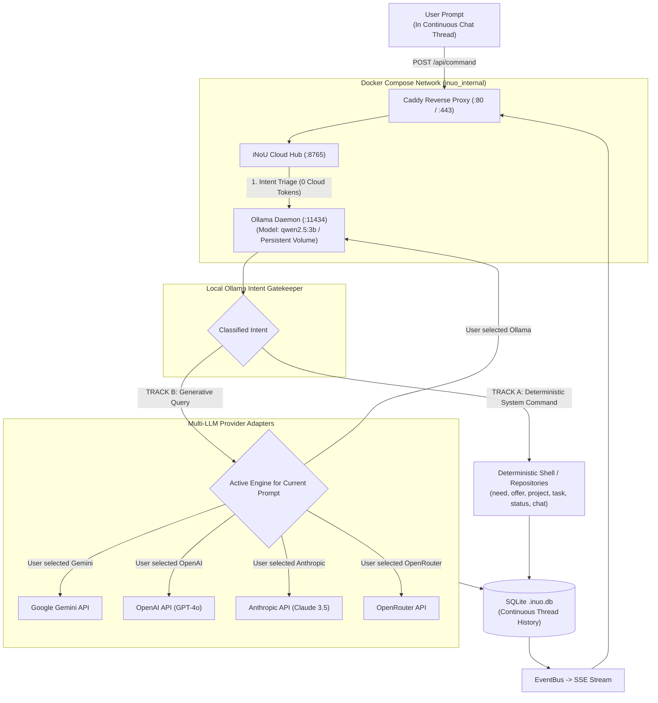

# Technical Specification: Docker Ollama Intent Triage & Dynamic Multi-Engine Chat Routing

## 1. Executive Summary

This specification defines the architectural design and implementation details for:
1. **Unified Chat Thread with Dynamic Engine Switching**: Maintaining a single, continuous conversation context where the user can freely switch between LLM engines (Ollama, Gemini, OpenAI, Claude, OpenRouter) turn-by-turn depending on the prompt.
2. **Containerized Ollama Intent Triage**: An always-on, zero-cost local SLM (`qwen2.5:3b` in Docker) that triages every prompt into either an **iNoU System Command** or a **Generative Query** to the selected engine.
3. **Turn-by-Turn Attribution & Provider Branding**: Displaying provider icons/badges on each chat row and message bubble, enabling instant engine switching, and branding in the sidebar Config pane.
4. **Future Smart Auto-Routing**: Providing the architectural hook for Ollama to analyze prompt requirements and automatically recommend or route to the optimal LLM engine.

---

## 2. Docker & Multi-Engine Prompt Lifecycle



---

## 3. Dynamic Prompt Routing Architecture

### 3.1 Single Continuous Context Window
- **Context Preservation**: The entire chat history ($M_1, M_2, \dots, M_n$) is retained in the SQLite database under a single `chat_id`.
- **Engine Agility**: Message $M_1$ might be answered by **Ollama**, $M_2$ by **Claude 3.5 Sonnet** (for complex code), and $M_3$ by **Gemini Flash** (for fast summary). The prior conversation context is formatted into standard role-based messages (`system`, `user`, `assistant`) and fed to the newly chosen engine.

### 3.2 Triage Pipeline
```typescript
export interface IntentClassificationResult {
  track: 'COMMAND' | 'QUERY';
  commandLine?: string;          // e.g. "task add 'Draft PRD'" if TRACK A
  prompt?: string;               // Cleaned prompt if TRACK B
  suggestedEngine?: string;      // AI recommendation (e.g. 'anthropic' for code)
}
```

1. **Track A (System Command)**:
   - If user types: *"create a project called Alpha"* $\rightarrow$ Ollama extracts `project add Alpha` $\rightarrow$ Executes locally in 2ms without third-party API calls.
2. **Track B (Generative / Reasoning Query)**:
   - If user asks: *"compare these two system architectures"* $\rightarrow$ Hub retrieves the chat's **currently active engine** (e.g., `gemini-1.5-flash` or `gpt-4o`) and streams the prompt + context to that provider.

---

## 4. Per-Message Attribution & Data Model

### 4.1 Chat Entity (`src/interfaces/Chat.ts`)
```typescript
export interface Chat {
  id: string;
  title: string;
  status: "Active" | "Archived" | "Deleted";
  messageIds: string[];
  
  /** Currently selected engine for upcoming prompts */
  currentEngine: {
    providerId: "ollama" | "gemini" | "openai" | "anthropic" | "openrouter";
    model: string;              // e.g. "qwen2.5:3b", "gemini-1.5-flash", "claude-3-5-sonnet"
  };
  
  createdAt: string;
  updatedAt: string;
}
```

### 4.2 ChatMessage Metadata (`src/interfaces/Chat.ts`)
Each message tracks which engine produced it:
```typescript
export interface ChatMessage {
  id: string;
  chatId: string;
  role: "user" | "assistant" | "system";
  content: string;
  metadata?: {
    providerId?: "ollama" | "gemini" | "openai" | "anthropic" | "openrouter";
    model?: string;
    tokenCount?: { prompt: number; completion: number };
    executionTimeMs?: number;
  };
  createdAt: string;
}
```

---

## 5. UI/UX: Provider Branding & Turn-by-Turn Engine Selector

### 5.1 Provider Icon & Branding Tokens
| Provider | ID | Badge / Icon | Default Model | Primary Use Case |
| :--- | :--- | :--- | :--- | :--- |
| **Ollama** | `ollama` | `🦙` / SVG Badge | `qwen2.5:3b` | Intent triage, local offline tasks (0 tokens) |
| **Gemini** | `gemini` | `✨` / SVG Sparkle | `gemini-flash-latest` | Fast multimodal reasoning & large context |
| **OpenAI** | `openai` | `🟢` / SVG Spiral | `gpt-4o-mini` | General coding & structured outputs |
| **Anthropic** | `anthropic` | `🟣` / SVG Monogram | `claude-3-5-sonnet` | Complex logic, refactors & architectural design |
| **OpenRouter** | `openrouter` | `🪐` / SVG Orbit | `auto` | Unified routing across 100+ open/closed models |

### 5.2 Chat Row & Active Input Engine Selector
1. **Sidebar Chat Row (`#chat-list`)**:
   - Displays the current active engine badge (e.g. `✨ Gemini`).
   - Clicking the badge opens the **Engine Quick-Switcher**.
2. **Prompt Bar Engine Selector (Web UI Input Area)**:
   - Next to the input textarea, an interactive pill shows the **Active Engine** for the immediate next prompt.
   - User can click the pill (or press a shortcut) to switch from `🦙 Ollama` to `🟣 Claude` before hitting Enter.
3. **Message Bubble Attribution**:
   - Each assistant response bubble displays a discreet header showing which model generated that specific turn (e.g. `Generated by Claude 3.5 Sonnet (420 tokens)` or `Generated by Ollama (Local · 0 tokens)`).

### 5.3 Sidebar Config Tab (`#pane-config`)
- Top section (`⚙ Motores & LLMs`) displays all registered engines with connection health dots, configured API keys, and model parameters.

---

## 6. Future Extensibility: Smart Auto-Router

While manual user switching is the default mode, the architecture supports an optional **Auto-Route Mode**:
- **Ollama Heuristic Analysis**: If enabled, Ollama analyzes prompt complexity and tags the intent:
  - Code generation $\rightarrow$ auto-suggests or routes to `Claude 3.5 Sonnet`.
  - Simple factual query $\rightarrow$ answers directly on `Ollama` or `Gemini Flash`.
  - Mathematical / symbolic logic $\rightarrow$ routes to `GPT-4o`.
- A subtle UI prompt informs the user: `💡 Switched to Claude for code refactoring (Click to override)`.

---

## 7. Implementation Checklist

- [ ] **Phase 1: Database & Model Alignment**
  - Update `Chat` interface with `currentEngine` structure.
  - Update `ChatMessage` repository to store `providerId` and `model` in message metadata.
- [ ] **Phase 2: Docker Ollama Intent Engine**
  - Enhance `localAiClient.ts` to output `IntentClassificationResult`.
  - Connect triage output to execute either command or forward to `currentEngine`.
- [ ] **Phase 3: Web UI Provider Badges & Switcher**
  - Add SVG provider icons for Ollama, Gemini, OpenAI, Claude, OpenRouter.
  - Add engine switcher pill in chat rows and message input area.
  - Render provider badge on message bubbles.
- [ ] **Phase 4: Verification & Graph Refresh**
  - Run `npm run deploy:dry` and verify automated tests.
  - Refresh knowledge graph with `node scripts/update-graph.js`.
