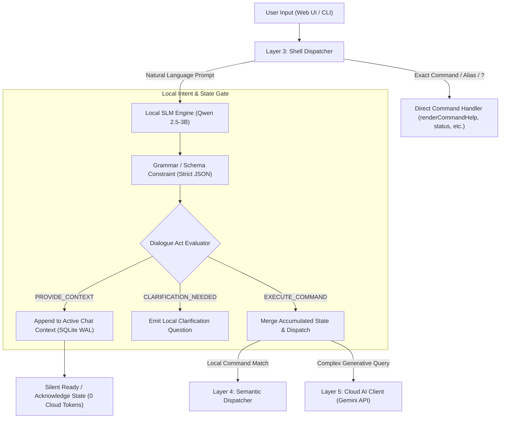

# Local Intent Interpretation & Dialogue State Tracking (DST)

| Property          | Value                                                              |
| :---------------- | :----------------------------------------------------------------- |
| **Status**        | `PROPOSED / ARCHITECTURAL SPEC & IMPLEMENTATION PLAN`              |
| **Selected Model**| **Qwen 2.5 (3B / 1.5B Instruct - Q4_K_M)**                         |
| **Primary Scope** | Local Semantic Extraction · Dialogue Act Classification · DST      |
| **Hardware Target**| Windows 11 (12 GB RAM) $\rightarrow$ Linux Host / Container Server |
| **Dev Rules**     | §7.1 Semantic Command Spec Parity · §3.1 Local SQLite First · DRY  |

---

## 1. Problem Statement & Core Architectural Goals

### 1.1 The Core Purpose of iNoU Conversational DST
The fundamental goal of iNoU's dialogue state tracking (DST) and intent engine is **Context Engineering and Detailed Prompt Synthesis from Human-Like Interaction**:
1. **Rich Context Accumulation**: Transform natural, fragmented, human conversational turns into a robust, structured state of facts, constraints, and configuration parameters.
2. **Contradiction Detection & Proactive Clarification**: Continuously compare incoming facts against accumulated state. If a user introduces conflicting instructions (e.g., *Turn 1: "servidor en el puerto 3000 con PostgreSQL"* vs *Turn 4: "corre en el puerto 8080 con SQLite"*), iNoU detects the clash immediately, pauses execution, and prompts the user for clarification before executing.
3. **High-Fidelity Prompt Synthesis**: When an execution order is given, synthesize a fully hydrated, unambiguous, and detailed execution plan from all previously gathered context.

---

### 1.2 Domain Boundary: "Connecting Needs" vs. "Conversational Context DST"

> [!IMPORTANT]
> **Clear Architectural Separation**:
> * **"Connecting Needs" ($\text{NEED} = \text{VERB} + \text{OBJECT} \leftrightarrow \text{OFFER} = \text{COMP\_VERB} + \text{OBJECT}$)**:
>   This is the **P2P Marketplace & Matching Engine** of specifications for publishing and discovering public supply/demand items across the decentralized Colmena network (e.g. `need create --verb Request --object "Comida"`).
> * **"Conversational Assistant & Context DST"**:
>   When a user converses naturally with iNoU (e.g., *"ayúdame a configurar la base de datos"*, *"el servidor corre en el puerto 3000"*, *"hazlo ahora"*), this is **NOT** a marketplace listing. It represents conversational context accumulation, state tracking, and local workflow orchestration. iNoU must **never** mistakenly convert general conversational dialogue into public `need create` / `offer create` marketplace items unless explicitly instructed by the user.

---

### 1.3 Key Flaws in Traditional Cloud AI Approaches

1. **Greedy Cloud Execution**: Standard cloud LLM integrations (like Gemini via `@google/genai`) treat every conversational turn as an immediate, actionable command.
2. **Context Fragmentation**: When users share context incrementally across separate prompts (e.g., environment variables, constraints, or background facts), cloud models often hallucinate prematurely, attempt to guess the next command, or lose track of accumulated facts.
3. **Unnecessary Token Cost & Latency**: Sending small multi-turn clarification or context-sharing prompts to cloud APIs incurs avoidable latency, token consumption, and internet dependency.

---

## 2. Target Constraints & Hardware Profile

* **Initial Environment**: Windows 11 (12 GB RAM total).
* **Production Deployment**: Headless Linux Server / Container.
* **Language Requirements**: Strict Multilingual coverage (**EN**, **ES**, **FR**, **DE**, **PT**) matching iNoU's internationalization (`src/i18n`).
* **Output Requirement**: Pure structured JSON (zero conversational filler, zero markdown preambles).
* **Launch & UX Requirement**: **Instant Launch (<50ms)**. iNoU must boot up immediately. First-time setup runs in the background showing a step-by-step wizard with animated progress bars / dots.

---

## 3. Model Evaluation & Selection Matrix

To identify the optimal local model for pure intent extraction and dialogue state tracking:

| Evaluation Dimension | **Qwen 2.5 (3B / 1.5B)** | Llama 3.2 (3B / 1B) | Phi-3.5-mini (3.8B) | Gemma 2 (2B) |
| :--- | :--- | :--- | :--- | :--- |
| **Multilingual (EN, ES, FR, DE, PT)** | 🟢 **Superior (152k vocab)**<br>Preserves grammar & entity tokens across Romance/Germanic languages. | 🟡 **Moderate**<br>Optimized heavily for English; higher token fragmentation on non-EN prompts. | 🟡 **Fair**<br>Strong on code/English; weaker non-English token stability. | 🟢 **Good (256k vocab)**<br>Large vocab, but struggles with multilingual JSON formatting. |
| **Strict JSON Adherence** | 🟢 **Flawless**<br>Adheres rigidly to output schemas without conversational preambles. | 🟡 **Moderate**<br>Prone to wrapping responses in commentary without grammar enforcement. | 🟡 **Moderate**<br>Frequently adds reasoning preambles. | 🔴 **Weak**<br>Known formatting instability on short context outputs. |
| **RAM Footprint (Q4_K_M)** | 🟢 **~2.0 GB (3B) / ~1.1 GB (1.5B)**<br>Leaves >9.5 GB free on 12 GB Win 11 machine. | 🟢 **~1.8 GB (3B) / ~0.8 GB (1B)** | 🟡 **~2.5 GB – 3.0 GB** | 🟢 **~1.6 GB** |
| **Inference Latency (CPU)** | 🟢 **~100–200ms (3B) / <80ms (1.5B)** | 🟢 **~90–180ms** | 🟡 **~300–500ms** | 🟢 **~120–220ms** |
| **Verdict** | 🏆 **PRIMARY SELECTION** | Alternative (EN-only) | Too heavy / reasoning-focused | Formatting risk |

> [!TIP]
> **Selected Model**: `Qwen2.5:3b-instruct` (Q4_K_M) provides the optimal balance of multilingual accuracy and sub-second CPU speed. `Qwen2.5:1.5b-instruct` can be toggled as an ultra-low-latency fallback.

---

## 4. Architectural Solution: Decoupled Intent & State Tracking



---

## 5. Instant Launch & First-Time Setup Screen (UI/UX Specification)

### 5.1 Immediate Startup Guarantee
* Both CLI (`inuo`) and Web UI (`inuo web`) boot in **< 50ms**.
* Built-in commands (`?`, `help`, `status`, `catalog`, `need`, `offer`) are immediately responsive and never blocked by background model setup.

### 5.2 First-Time Setup Wizard (Web UI & CLI TUI)

When a new session begins and local SLM is not yet active, an interactive setup banner or modal is presented:

```text
┌────────────────────────────────────────────────────────────────────────┐
│  ⚡ iNoU Local Semantic Engine — First-Time Setup                      │
│                                                                        │
│  [✔] Step 1/3: Environment & Ollama Engine Detected                    │
│  [●] Step 2/3: Model Provisioning (Qwen 2.5 - 3B)                     │
│      Progress: [████████████████░░░░] 78% (1.5 GB / 1.9 GB) • 21 MB/s │
│  [○] Step 3/3: Validating JSON Intent Parser                           │
│                                                                        │
│  💡 You can continue using iNoU commands while download completes...   │
└────────────────────────────────────────────────────────────────────────┘
```

### 5.3 Live Progress Stream Architecture (SSE)

1. **Background Setup Worker**: Streams download progress events over the existing EventBus (`LAYER 7 · EventBus + SSE` in `src/api/events/EventBus.ts`).
2. **Web UI Listener (`browser/app.ts`)**: Listens to `setup_progress` events on `/api/stream` and smoothly animates the progress bar without page refreshes.
3. **CLI TUI Listener (`src/cli/tuiEngine.ts`)**: Updates the status bar / notification line with a live indicator: `⬇ Downloading Qwen 2.5: [████░░] 65%`.

---

## 6. Turn Classification Schema (Structured Output)

The local model is invoked with a strict JSON schema contract:

```json
{
  "dialogue_act": "PROVIDE_CONTEXT | EXECUTE_COMMAND | CLARIFICATION | CHAT",
  "primary_intent": "string",
  "confidence": 0.98,
  "language": "en | es | fr | de | pt",
  "delta_facts": {
    "key": "value"
  },
  "requires_action": false,
  "user_facing_summary": "string"
}
```

### Dialogue Act Semantics

| Dialogue Act | Meaning | Action Taken | Cloud LLM Called? |
| :--- | :--- | :--- | :--- |
| `PROVIDE_CONTEXT` | User is declaring facts, constraints, or background info. | Persist `delta_facts` into active `ChatSession` state in SQLite. | **No** (0 tokens) |
| `CLARIFICATION` | User response or ambiguity requiring confirmation. | Prompt user with targeted question locally. | **No** (0 tokens) |
| `CHAT` | Casual conversational remark / greeting. | Return local greeting or brief response. | **No** (0 tokens) |
| `EXECUTE_COMMAND` | Explicit directive to perform a task. | Hydrate command with all accumulated session facts and dispatch. | Only if complex / generative |

---

## 7. Real-World Multilingual Execution Traces

### Trace 1: Incremental Context Accumulation (Spanish)

* **Prompt 1**: *"Por favor asegúrate de usar SQLite y el puerto 3000 para este workspace"*
  * **Qwen Output**:
    ```json
    {
      "dialogue_act": "PROVIDE_CONTEXT",
      "primary_intent": "configure_workspace",
      "confidence": 0.98,
      "language": "es",
      "delta_facts": { "database": "sqlite", "port": 3000 },
      "requires_action": false
    }
    ```
  * **Action**: Saved to `.inuo.db` `activeChat.contextState`. 0 cloud tokens spent. No commands run.

* **Prompt 2**: *"Y que el modo de operación sea standalone"*
  * **Qwen Output**:
    ```json
    {
      "dialogue_act": "PROVIDE_CONTEXT",
      "primary_intent": "configure_workspace",
      "confidence": 0.97,
      "language": "es",
      "delta_facts": { "mode": "standalone" },
      "requires_action": false
    }
    ```
  * **Action**: Merged into `activeChat.contextState`. Ready for subsequent commands.

* **Prompt 3**: *"Inicia la configuración ahora"*
  * **Qwen Output**:
    ```json
    {
      "dialogue_act": "EXECUTE_COMMAND",
      "primary_intent": "setup",
      "confidence": 0.99,
      "language": "es",
      "delta_facts": {},
      "requires_action": true
    }
    ```
  * **Action**: iNoU executes `setupCommand` passing merged `{ database: "sqlite", port: 3000, mode: "standalone" }`.

---

## 8. Runtime & Dispatcher Integration

### 8.1 Command vs. Natural Language Routing
* **Direct Commands & Help (`?`, `help`, `commands`, `status`)**: Dispatched immediately by `shell.ts` with 0 delay.
* **Natural Language Prompts**: Evaluated by `src/cli/localAiClient.ts` against `Qwen 2.5` on `http://localhost:11434`, returning structured JSON details.
* **Cloud Fallback**: If local SLM is offline or not installed, gracefully falls back to Gemini API.
